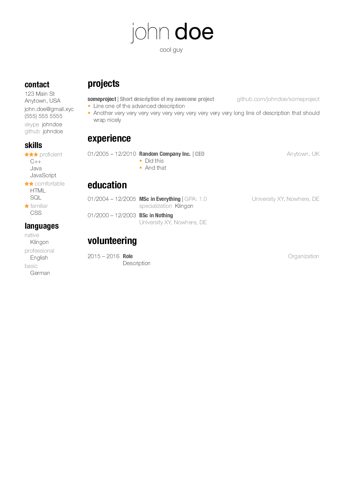

# friggeri-minimal-cv

LaTeX CV template

## Usage

* Make sure *Helvetica Neue* font is installed
* Modify [example-cv.tex](example-cv.tex) to suit your needs
* Compile with XeLaTeX

## Credits

This template was adapted from the original friggeri-cv written by [Adrien Friggeri](http://www.friggeri.net/).

## Licence

[Creative Commons 3.0 licence](http://creativecommons.org/licenses/by-nc-sa/3.0/)
